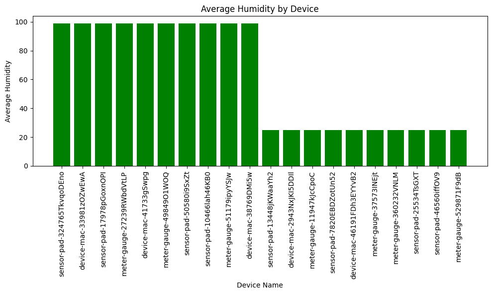

# IDS 706 - Individual Project 3

In this project, we expand upon the pipeline created in miniproject 11 to create complex data ETL and finally complex visualizations that are able to communicate key data insights in an automated data pipeline with an automatic trigger.

# Databricks Data Pipeline

In this project we create a data pipeline with Databricks. This pipeline integrates data sources and destinations, loading, processing and querying the data in the pipeline effectively.

## Dataset

In this project, we use a dataset included in the Databricks documentation. This dataset is IoT data of various devices and information on their runtime parameters.

## Guide

This project is guided by the official [Databricks Data Pipeline documentation](https://docs.databricks.com/en/getting-started/data-pipeline-get-started.html).

## Project Steps
The steps carried out to execute this project are:

### Cluster Creation
We create a databricks cluster as the basis for our data pipeline.

### Extract Data

The data_extract notebook contains the script to extract the appropriate dataset from the databricks example datasets.

### Transform And Load Data

This is a simple SQL query that creates a processed table that contains appropriate transformations from the extracted data.

### Querying And Visualizing Data

In this step, we query the data and output the results to show stats on some devices. We then create an appropriate visualization using a complex query.

#### Query and Visualization Interpetation And Analysis

**Data Querying:** The code begins by querying data from the `processed_iot_data` table. It selects the `device_name`, and the average `temp` and `humidity` for each device. The query is more selective by including only devices where the `lcd` is 'red' and the country (`cn`) is "United States". 

**Data Validation:** After querying the data, it checks if any rows were returned. If no rows were returned, it prints “No data queried”. If rows were returned, it prints the number of rows available.

**Data Conversion:** The queried data is then converted to a Pandas DataFrame for easier manipulation and visualization.

**Data Visualization:** Finally, the code creates a bar plot of the average humidity for each device. The x-axis represents the device names and the y-axis represents the average humidity. The plot is saved as ‘avg_humidity.png’.

The visualization is a bar plot showing the average humidity for each device. The devices are ordered by their average humidity. This visualization allows you to quickly compare the average humidity across different devices. Devices with higher average humidity have taller bars, while devices with lower average humidity have shorter bars. This can help you identify which devices tend to operate in more humid environments.

From the visualization, we can clearly see that in the class of devices subsetted to, there is a clear discrepancy in average humidity between these 2 device groups. this is a valuable insight that we have extracted using this query and subsequent visualization of the data.

### Databricks Job

We then create a Databricks job to automate the execution of all three steps - data_extract, data_transformload and data_queryandvisualize, creating an automated pipeline.

### Scheduled Run Trigger

We make a specific trigger in databricks so that the data pipeline auto runs at a fixed interval, ensuring that the newest data is used for each pipeline run.

## Conclusion and Recommendation

Based on the results of the data analysis, we recommend that the management team take into account the average humidity levels of the devices when making decisions about device deployment and maintenance. Devices operating in more humid environments may require more frequent maintenance or replacement. This recommendation is actionable and can help improve the efficiency and longevity of the devices.

## Running the Program

To run the program, follow these steps:

1. Clone the repository to your local machine.
2. Navigate to the directory containing the project.
3. Open the Databricks workspace and import the notebooks.
4. Create a Databricks cluster and attach the notebooks to the cluster.
5. Run the notebooks in the following order: data_extract, data_transformload, data_queryandvisualize.
6. View the results in the data_queryandvisualize notebook.
7. If you want to similarly schedule a trigger, create a job that runs all 3 notebooks and schedule the job to run every so often.

Please ensure that you have the necessary permissions and resources to create and run Databricks clusters.